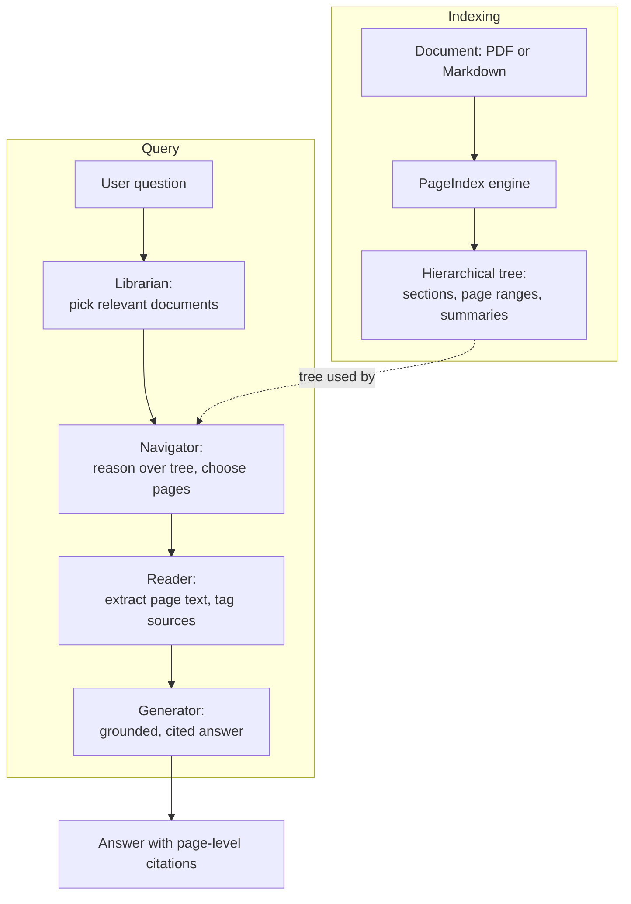

# 📚 VectorlessRAG

> RAG without a vector database — retrieval by LLM reasoning over a document's structure.

[](https://www.python.org/)
[](./docs/architecture.md)
[](https://github.com/BerriAI/litellm)
[](./LICENSE)
[](#roadmap)

---

## What is VectorlessRAG?

VectorlessRAG is a Retrieval-Augmented Generation system that retrieves **without a vector database**. Instead of splitting documents into chunks and embedding them for nearest-neighbour search, it parses each document into a **hierarchical tree** that mirrors its table of contents — sections and subsections with their page ranges (for PDFs) or line numbers (for Markdown), plus an LLM-written summary on every node. That indexing work is done by the **PageIndex** engine.

At query time, an LLM **reasons over the tree** the way a person scans a contents page: it reads the structure, decides which pages are relevant, and then answers **only** from the text on those pages — with page-level citations. Retrieval is *reasoning over structure*, not nearest-neighbour over embeddings. The only embeddings in the system are an **optional, local, document-level pre-filter** (one embedding per document description, never per chunk) that narrows a large library down to a few candidate documents before the LLM takes over. There is no vector database on the in-document retrieval path.

## Why vectorless?

- **No vector DB infrastructure** — nothing to provision, index, or keep in sync; the index is plain JSON on disk.
- **Preserved document structure** — the table of contents, section hierarchy, and page boundaries stay intact instead of being flattened into chunks.
- **Explainable, reasoning-based retrieval** — the model returns *why* it chose a page range, not an opaque similarity score.
- **Precise page-level citations** — every answer is tagged with the source document and page (or line) it came from.
- **Human-in-the-loop (HITL)** — you can confirm, override, or skip the model's decision at each of the four query stages.

## Architecture at a glance



The four query stages — the **Librarian**, the **Navigator**, the **Reader**, and the **Generator** — are described in detail in [./docs/architecture.md](./docs/architecture.md) and [./docs/methodology.md](./docs/methodology.md).

## Quickstart

```bash
# 1. Clone
git clone <your-fork-url> VectorlessRAG
cd VectorlessRAG

# 2. Install dependencies (Python 3.10+)
pip install -r requirements.txt

# 3. Configure credentials
cp .env.example .env
# Edit .env and set:
#   NVIDIA_API_KEY=...      (required - NVIDIA NIM auth)
#   OPENROUTER_API_KEY=...  (required by the RAGG.py startup guard)

# 4. Add documents to index
#    Drop your PDFs and/or Markdown files into documents/

# 5. Run the interactive RAG CLI
python RAGG.py
```

`RAGG.py` indexes documents on demand and runs the full four-stage query pipeline with human-in-the-loop confirmation at each step.

To index a **single file** and dump its tree to `results/<name>_structure.json` without launching the chat UI, use the standalone CLI:

```bash
python run_pageindex.py --pdf_path documents/your-file.pdf
# or, for Markdown:
python run_pageindex.py --md_path documents/your-file.md
```

See [./docs/getting-started.md](./docs/getting-started.md) for a step-by-step walkthrough.

## Example

The following is an illustrative session showing the four stages in action:

```text
> Ask a question: How do I undo the last Git commit?

[Librarian] Pre-filtering documents by description...
  Selected: git-cheat-sheet-education.pdf
  Reason: covers Git commands including commit, reset, and revert.
  Confirm this document? [Y/n] y

[Navigator] Reasoning over the document tree...
  Plan: {"pages": "2", "reasoning": "Page 2 lists undo/reset commands."}
  Approve page range "2"? [Y/n] y

[Reader] Extracting text for the selected pages...
  Tagged 1 span: [Source: git-cheat-sheet-education.pdf, Page 2]

[Generator] Answering only from retrieved context...

To undo the last commit while keeping your changes staged, run:
    git reset --soft HEAD~1
To undo it and unstage the changes, use `git reset HEAD~1`.

Source: git-cheat-sheet-education.pdf, Page 2
```

If the answer is not on the retrieved pages, the Generator says so explicitly rather than guessing — for example, *"This information isn't in the retrieved pages."*

## Documentation

Full documentation lives in [`docs/`](./docs/README.md). Start at the hub and dive into the area you need.

| Document | What it covers |
| --- | --- |
| [docs/README.md](./docs/README.md) | Documentation index / hub |
| [docs/getting-started.md](./docs/getting-started.md) | Install, configure, and run your first query |
| [docs/architecture.md](./docs/architecture.md) | System design and the four query stages |
| [docs/methodology.md](./docs/methodology.md) | How indexing and vectorless retrieval work |
| [docs/api-reference.md](./docs/api-reference.md) | `PageIndexClient` and module-level functions |
| [docs/configuration.md](./docs/configuration.md) | `config.yaml` keys and environment variables |
| [docs/research-background.md](./docs/research-background.md) | Motivation and the reasoning-over-structure idea |
| [docs/evaluation.md](./docs/evaluation.md) | How the system is evaluated (and its limits) |
| [docs/data-formats.md](./docs/data-formats.md) | Tree nodes, metadata, and on-disk JSON |
| [docs/engineering-robustness.md](./docs/engineering-robustness.md) | Fallbacks, retries, and graceful degradation |
| [docs/glossary.md](./docs/glossary.md) | Definitions of key terms used across the docs |
| [docs/references.md](./docs/references.md) | Academic references and infrastructure pointers |

## Project structure

```text
VectorlessRAG/
├── RAGG.py                  # Interactive CLI orchestrator: 4-stage query pipeline (HITL)
├── run_pageindex.py         # Standalone CLI: index one file -> results/<name>_structure.json
├── pageindex/               # The PageIndex indexing & retrieval engine
│   ├── __init__.py          # Public exports (page_index, md_to_tree, retrieve fns, PageIndexClient)
│   ├── client.py            # PageIndexClient: index/get_document/get_*_content, JSON persistence
│   ├── page_index.py        # Adaptive multi-strategy PDF indexing (TOC detection -> tree)
│   ├── page_index_md.py     # Markdown indexing: header regex -> line-addressed tree
│   ├── retrieve.py          # Tool functions: document/structure/page-content extraction
│   ├── utils.py             # LiteLLM wrappers, local embeddings, tree utils, ConfigLoader
│   └── config.yaml          # Default indexing configuration
├── documents/               # Source PDFs / Markdown to index (3 sample PDFs ship here)
├── workspace/               # Indexed output: <doc_id>.json trees + _meta.json registry
├── logs/                    # Per-index trace JSON for debugging/auditing (gitignored)
├── docs/                    # Documentation suite
├── requirements.txt         # Pinned Python dependencies
└── .env.example             # Template for required/optional credentials
```

## Tech stack

- **[LiteLLM](https://github.com/BerriAI/litellm)** — unified LLM client used for indexing, retrieval, and answering.
- **NVIDIA NIM** — serves `nvidia/llama-3.3-nemotron-super-49b-v1`, the default model for all three LLM roles in `RAGG.py`.
- **[sentence-transformers](https://www.sbert.net/)** (`all-MiniLM-L6-v2`, 384-dim) — runs **locally** for the optional document-level embedding pre-filter; no external embedding API.
- **PyMuPDF** / **PyPDF2** — PDF text and per-page token extraction.
- **[rich](https://github.com/Textualize/rich)** — terminal UI (tables, panels, progress, Markdown rendering).
- **PyYAML** — loads `pageindex/config.yaml`.

## Roadmap

Current evaluation is **qualitative** (a comparison against vector RAG) plus an **internal self-signal**: `verify_toc` measures the fraction of sampled sections whose title genuinely appears on its claimed page — an indexing-quality gate, not an answer-quality benchmark. There are no published recall, faithfulness, or latency numbers yet. Planned directions:

- **Quantitative benchmarking** — measure retrieval and answer quality on labelled datasets.
- **Caching** — reuse retrieval plans and page extractions across related queries.
- **Multi-hop tree descent** — let the Navigator drill from coarse to fine nodes across multiple steps.
- **Hybrid retrieval** — combine the local embedding pre-filter with structural reasoning more deeply.

See [./docs/evaluation.md](./docs/evaluation.md) for an honest account of what is and isn't measured today.

## License

Released under the **MIT License** © 2026 Udit Sharma. See [LICENSE](./LICENSE).

---

<div align="center"><sub>🔱 Built by Udit</sub></div>

## See also

- [docs/README.md](./docs/README.md) — documentation hub
- [docs/getting-started.md](./docs/getting-started.md) — install and first query
- [docs/architecture.md](./docs/architecture.md) — system design and the four stages
- [docs/evaluation.md](./docs/evaluation.md) — how the system is evaluated
