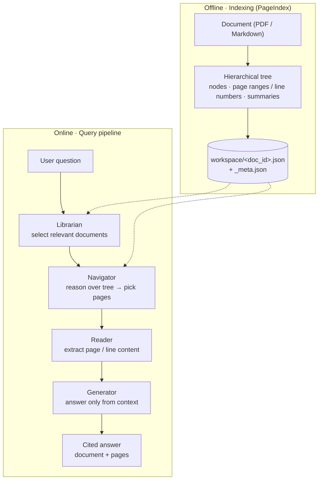

# VectorlessRAG Documentation 📚

**VectorlessRAG** is a Retrieval-Augmented Generation system that retrieves *without* a vector database. Instead of embedding chunks and running nearest-neighbour search, it parses each document into a hierarchical tree that mirrors the document's table of contents — sections and subsections, each with a page range (or line number) and an LLM-written summary — using the **PageIndex** engine. At query time, an LLM *reasons over that tree* (much like a person scanning a contents page) to decide which pages to read, then answers strictly from those pages with page-level citations. Retrieval here is **reasoning over structure**, not nearest-neighbour over embeddings.

**Start here:** new to the project? Read [Getting Started](./getting-started.md) first.

## The documentation suite

The docs are organised into two reading tracks plus a reference section. Pick the track that matches your goal, or jump straight to a reference page.

### Developer track

For building, running, configuring, and integrating VectorlessRAG.

| Doc | What it covers |
| --- | --- |
| [Getting Started](./getting-started.md) | Prerequisites, installation, API keys, adding documents, and running the interactive app. |
| [Architecture](./architecture.md) | The component map, the two-stage retrieval insight, the online query pipeline, and the persistence model. |
| [API & CLI Reference](./api-reference.md) | The `PageIndexClient` API, the retrieval tool functions, indexing entry points, and the `run_pageindex.py` CLI. |
| [Configuration](./configuration.md) | How configuration is layered, the `config.yaml` keys, environment variables, model routing, and a tuning guide. |

### Research track

For understanding *why* the design works and how it is positioned against conventional RAG.

| Doc | What it covers |
| --- | --- |
| [Research & Background](./research-background.md) | The problem statement, a RAG primer, the structural costs of vector RAG, and the vectorless alternative. |
| [How It Works (Methodology)](./methodology.md) | Indexing a document into a tree, the strategy decision tree, Markdown indexing, and the query phase in detail. |
| [Evaluation, Limitations & Roadmap](./evaluation.md) | The (honest) evaluation approach, the qualitative comparison, the internal quality signal, limitations, and future work. |

### Reference

Detail pages you will return to.

| Doc | What it covers |
| --- | --- |
| [Data Formats & Schemas](./data-formats.md) | The tree node, the flat TOC item, document metadata, and the `workspace/`, `logs/`, and `results/` layouts. |
| [Engineering & Robustness](./engineering-robustness.md) | Graceful degradation, page-offset correction, robust output parsing, type-aware addressing, and cost-aware control flow. |
| [Glossary](./glossary.md) | Definitions of every key term, with a note on consistent terminology. |
| [References & Further Reading](./references.md) | Academic references, engine and infrastructure pointers, and further reading. |

## System at a glance

Indexing happens **offline** — each document becomes a persisted tree. Querying happens **online** through four stages: the **Librarian** picks the right documents, the **Navigator** picks the right pages, the **Reader** extracts those pages, and the **Generator** answers strictly from them with citations.

For a deeper look at the pipeline and how the pieces fit together, see [Architecture](./architecture.md) and [How It Works (Methodology)](./methodology.md).

## See also

- [Getting Started](./getting-started.md) — install and run VectorlessRAG.
- [Architecture](./architecture.md) — the system design end to end.
- [Research & Background](./research-background.md) — the motivation and the vectorless idea.
- Project root: [../README.md](../README.md) — the top-level repository README.
