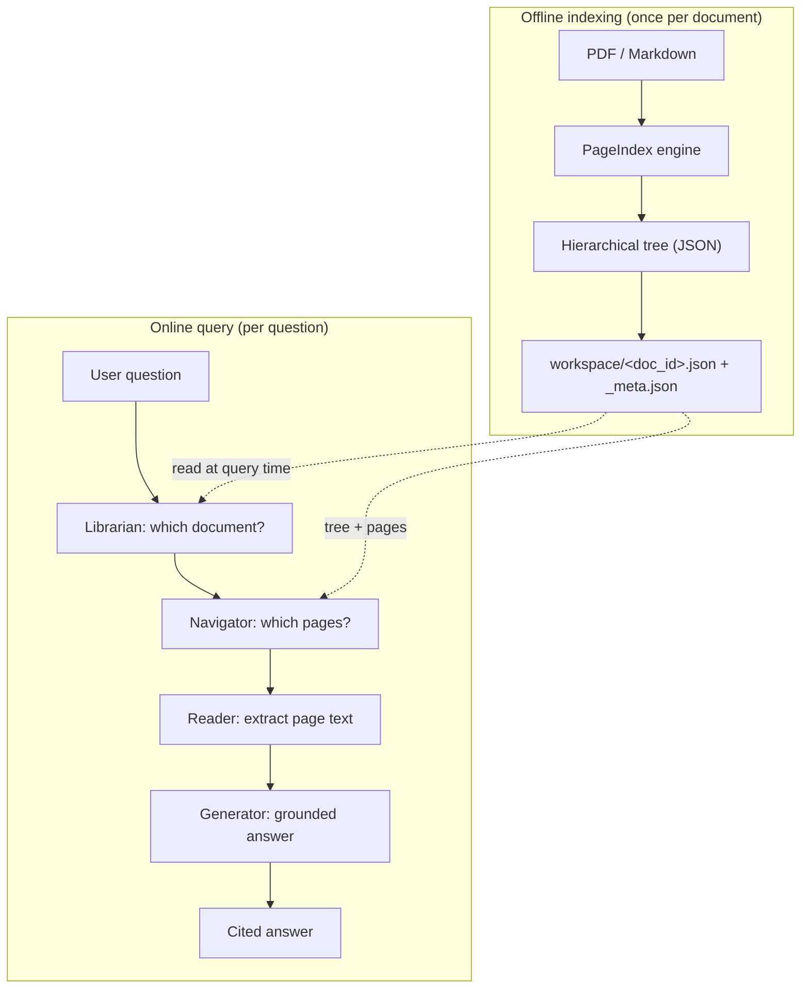
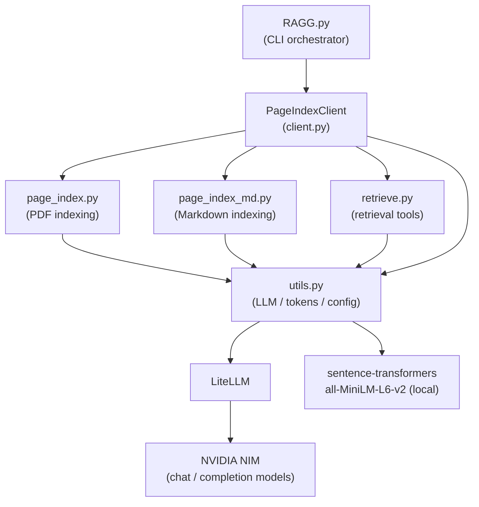
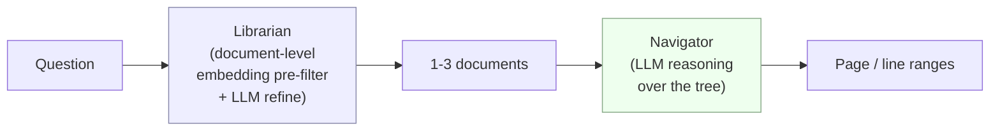
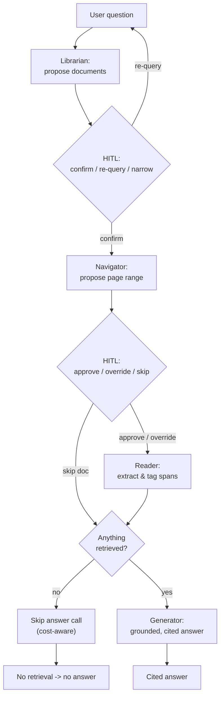

# Architecture

This page gives an engineer the shape of **VectorlessRAG**: the two phases it runs in, the files that implement them, how those files talk to each other, and the design principles that hold the system together.

VectorlessRAG retrieves *without* a vector database. Each document is parsed into a hierarchical tree that mirrors its table of contents (sections and subsections with page ranges and LLM-written summaries). At query time an LLM **reasons over that tree** to decide which pages to read, then answers only from those pages with page-level citations. Retrieval is reasoning over structure, not nearest-neighbour search over embeddings.

## System at a glance

The system has two phases that are cleanly separated:

- **Offline indexing** — run *once per document*. The PageIndex engine parses a PDF or Markdown file into a hierarchical tree (JSON) and persists it to the `workspace/` directory.
- **Online query** — run *per question*. A four-stage pipeline (Librarian, Navigator, Reader, Generator) walks from the user's question to a cited answer.

The offline phase produces durable artifacts; the online phase consumes them. Indexing is the expensive, LLM-heavy step you pay for once. Querying reuses the stored tree repeatedly.

## Component map

Each source file owns one clear responsibility.

| File | Responsibility |
| --- | --- |
| [`../RAGG.py`](../RAGG.py) | Interactive CLI orchestrator. Drives the four-stage query pipeline (Librarian, Navigator, Reader, Generator) with a human-in-the-loop checkpoint at each decision. Renders the UI with the `rich` library. |
| [`../pageindex/client.py`](../pageindex/client.py) | `PageIndexClient` — the facade over indexing, retrieval, and persistence. Owns `workspace/<doc_id>.json` and `workspace/_meta.json`, plus lazy loading. |
| [`../pageindex/page_index.py`](../pageindex/page_index.py) | PDF indexing engine. Adaptive, multi-strategy TOC detection and tree construction with graceful degradation. |
| [`../pageindex/page_index_md.py`](../pageindex/page_index_md.py) | Markdown indexing (`md_to_tree`). Regex header extraction, stack-based tree build, addressed by line numbers. |
| [`../pageindex/retrieve.py`](../pageindex/retrieve.py) | Retrieval tool functions: `get_document`, `get_document_structure` (strips text fields), `get_page_content` (parses page ranges). |
| [`../pageindex/utils.py`](../pageindex/utils.py) | LLM/token/config utilities: LiteLLM wrappers, token counting, tree helpers, local embeddings, and `ConfigLoader`. |
| [`../run_pageindex.py`](../run_pageindex.py) | Standalone CLI to index a single file and dump its tree to `results/<name>_structure.json`. |
| [`../pageindex/config.yaml`](../pageindex/config.yaml) | Default configuration (models, TOC scan depth, node-size thresholds, enrichment toggles). |

## Component diagram

The orchestrator depends only on the `PageIndexClient` facade. The facade fans out to the indexing engines, the retrieval tools, and the shared utilities. All LLM traffic and all embedding work converge in `utils.py`.

Two things are worth noting in this diagram:

- **LLM calls** (indexing, TOC processing, summaries, retrieval reasoning, answer generation) route through LiteLLM to NVIDIA NIM. This is the only place provider details live, which keeps the system provider-agnostic.
- **Embeddings** are produced locally by `sentence-transformers/all-MiniLM-L6-v2` (384-dim) via `langchain-huggingface`. There is no external embedding API. See [`./configuration.md`](./configuration.md) for the exact model configuration.

## The two-stage retrieval insight (the library metaphor)

Retrieval is split into two stages that mirror how a person finds an answer in a physical library.

**The Librarian decides *which document*.** It runs a coarse, document-level pre-filter: each document carries one description embedding (the LLM-written `doc_description`, embedded once at index time). The Librarian compares the question against those description embeddings by cosine similarity, takes the top-N (5), then asks the LLM to refine the shortlist down to 1-3 documents. A fallback (`_llm_select_documents_fallback`) handles indices that have no stored embeddings.

**The Navigator decides *which pages*.** This is the vectorless core. It hands the chosen document's tree to the LLM, which reasons over the section titles, summaries, and page ranges — like scanning a contents page — and returns a JSON range such as `{"pages": "3-5,8", "reasoning": "..."}`. No embeddings are involved here at all.

The critical property: **embeddings appear only at document granularity, never at chunk level.** There is no chunk index, no nearest-neighbour search over passages, and no vector database. The fine-grained "which content" decision is made entirely by LLM reasoning over the document's structure.

## The online query pipeline

The four stages run in order, each with a **human-in-the-loop (HITL)** checkpoint. The user can confirm a decision, override it, or skip — keeping the human in control of cost and grounding.

1. **Librarian** (`select_relevant_documents`) — proposes 1-3 relevant documents. The user confirms, re-queries, or narrows the selection by name.
2. **Navigator** (`retrieve_pages`) — proposes a page range per document. The pipeline is type-aware: PDFs are addressed by physical page numbers, Markdown by line numbers (each node's `line_num`). The user approves the range, manually overrides it, or skips the document.
3. **Reader** (`get_page_content`) — extracts the text for the chosen pages or lines and tags each span `[Source: <doc_name>, Page N]`.
4. **Generator** (`generate_answer`) — answers under a strict grounded system prompt: respond *only* from the retrieved context; if the answer is not present, say "This information isn't in the retrieved pages."; cite the document and pages. Prior conversation turns are intentionally not replayed, which preserves grounding.

Two efficiency behaviours sit inside the pipeline:

- **Cost-aware skip.** If nothing was retrieved (every document skipped, or an empty range), the Generator's LLM call is skipped entirely — no answer call, no cost.
- **Single-document grounding.** The Generator sees only the tagged, retrieved spans, never the full corpus or conversation history.

## Offline indexing (overview)

Indexing turns a raw file into a hierarchical tree. For PDFs, `page_index.py` reads per-page tokens, detects whether a table of contents exists (and whether it lists page numbers), then selects a strategy: parse a TOC with page numbers (computing a physical-page offset), parse a TOC without page numbers (locating each section by scanning the body), or generate a hierarchy directly from body text when no TOC exists. It verifies the result, fixes mislocated sections, subdivides oversized nodes, and enriches every node with IDs and summaries. Markdown follows a simpler header-based path in `page_index_md.py`. The full pipeline — strategy selection, `verify_toc`, recursive subdivision, and enrichment — is documented in [`./methodology.md`](./methodology.md).

## Persistence model

Indexed output is stored under `workspace/`:

- **`workspace/<doc_id>.json`** — the full hierarchical tree plus cached page content for that document.
- **`workspace/_meta.json`** — a lightweight registry mapping `doc_id` to its type, name, description, page count, path, and the 384-dim `doc_description_embedding` used by the Librarian's pre-filter.

The registry is small and cheap to load, so the system reads it on startup to know what documents exist. Full per-document trees and cached pages are loaded **lazily** (via `_ensure_doc_loaded`) only when a document is actually selected. This keeps memory and I/O proportional to the documents in play, not the size of the whole corpus. The exact JSON shapes are specified in [`./data-formats.md`](./data-formats.md).

## Design principles

- **Vectorless by default.** No vector database and no chunk-level embeddings. The only embeddings are one per document, used as a coarse document-level pre-filter. The fine-grained retrieval decision is LLM reasoning over structure.
- **Explainable retrieval.** The Navigator returns its `reasoning` alongside the page range, and answers carry `[Source: <doc_name>, Page N]` citations — every step is inspectable.
- **Human-in-the-loop.** Each pipeline stage exposes a confirm / override / skip checkpoint, so a person stays in control of which documents and pages drive the answer.
- **Graceful degradation.** PDF indexing never discards a document: it falls back from "TOC with page numbers" to "TOC without page numbers" to "no TOC" to best-effort structure.
- **Provider-agnostic via LiteLLM.** All chat/completion traffic flows through LiteLLM, so the backing model (NVIDIA NIM by default) is a configuration detail, not a code dependency.

## See also

- [`./methodology.md`](./methodology.md) — the full offline indexing pipeline
- [`./data-formats.md`](./data-formats.md) — tree, metadata, and persistence JSON shapes
- [`./configuration.md`](./configuration.md) — models, config keys, and environment variables
- [`./README.md`](./README.md) — documentation index
