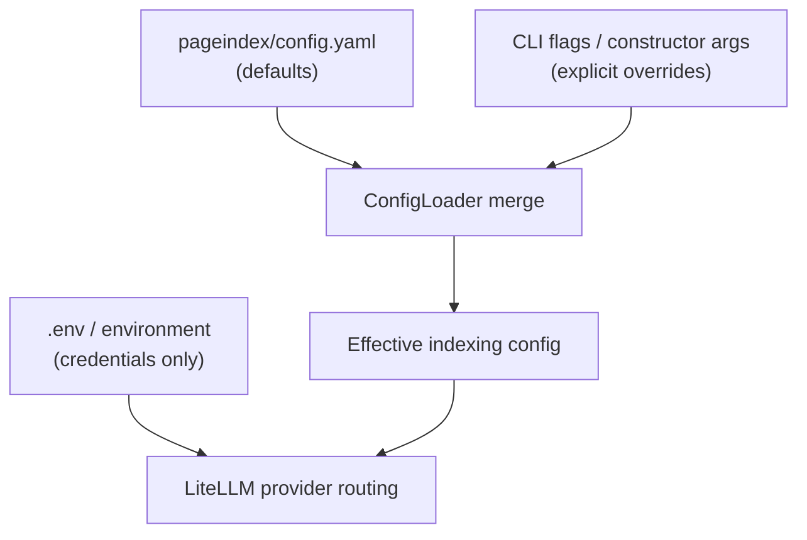

# Configuration

This page explains how to configure VectorlessRAG: which models it talks to, how credentials are supplied, and how to tune the PageIndex engine's indexing behaviour. It is aimed at someone who wants to point the system at a different LLM provider, control indexing cost and granularity, or simply understand where each setting lives.

## How configuration is layered

VectorlessRAG draws its settings from three places, in increasing order of specificity:

1. **`pageindex/config.yaml` defaults.** A small YAML file holding the indexing engine's defaults: which model to use, how deeply to scan for a table of contents, when to subdivide oversized nodes, and which enrichment passes to run.
2. **Explicit overrides.** Anything you pass directly wins over the file default:
   - For the standalone indexer `../run_pageindex.py`, overrides come from CLI flags.
   - For the library, overrides come from `PageIndexClient` constructor arguments (and keyword arguments to the lower-level helpers).
   The merge is handled by `ConfigLoader` in `../pageindex/utils.py`, which loads `config.yaml`, applies your overrides, and exposes the result as a namespace.
3. **Environment variables.** Credentials (API keys and base URLs) are never stored in `config.yaml`. They are read from the process environment, typically populated from a `.env` file.

> **Important:** the interactive orchestrator `../RAGG.py` does **not** read `config.yaml` for its model choices. It hardcodes its own model constants (see [Model and provider routing](#model-and-provider-routing) below) and only relies on environment variables for credentials. `config.yaml` governs the engine when invoked through `../run_pageindex.py` or `PageIndexClient` defaults.



## `config.yaml` reference

The file `../pageindex/config.yaml` ships with the following defaults:

```yaml
model: "gpt-4o-2024-11-20"
# model: "anthropic/claude-sonnet-4-6"
retrieve_model: "gpt-5.4"  # defaults to `model` if not set
toc_check_page_num: 20
max_page_num_each_node: 10
max_token_num_each_node: 20000
if_add_node_id: "yes"
max_toc_chunk_tokens: 4000 # New parameter for TOC chunking
if_add_node_summary: "yes"
if_add_doc_description: "no"
if_add_node_text: "no"
```

Every key, with its type, default, and meaning:

| Key | Type | Default | Meaning |
| --- | --- | --- | --- |
| `model` | string | `gpt-4o-2024-11-20` | Main LLM used by the indexing engine for TOC processing, structure generation, and summaries. Used by `../run_pageindex.py` and as the `PageIndexClient` default. `../RAGG.py` overrides this with its own model. |
| `retrieve_model` | string | `gpt-5.4` | Model used for retrieval (reasoning over the tree to choose pages). Defaults to `model` if left unset. |
| `toc_check_page_num` | int | `20` | How many leading pages to scan when looking for a table of contents. |
| `max_page_num_each_node` | int | `10` | Page threshold above which a node is recursively subdivided into finer subsections. |
| `max_token_num_each_node` | int | `20000` | Token threshold above which a node is recursively subdivided. |
| `if_add_node_id` | string | `yes` | Whether to assign a zero-padded `node_id` to each node. |
| `max_toc_chunk_tokens` | int | `4000` | Chunk size when transforming a long raw TOC into structured JSON. |
| `if_add_node_summary` | string | `yes` | Whether to generate a per-node summary with the LLM. |
| `if_add_doc_description` | string | `no` | Whether to generate a whole-document description with the LLM. |
| `if_add_node_text` | string | `no` | Whether to include each node's raw text in the output JSON (verbose; text is normally stripped for retrieval). |

The `if_add_*` keys use the string values `"yes"` / `"no"` rather than YAML booleans; keep that form when overriding them in the file.

## Environment variables (`.env`)

Credentials live in a `.env` file at the project root. It is gitignored (the `.gitignore` excludes `.env*`), so copy the tracked template and fill in your own values:

```bash
cp .env.example .env
# then edit .env and paste your key(s)
```

| Variable | Status | Purpose |
| --- | --- | --- |
| `NVIDIA_API_KEY` | **Required** | Authenticates against NVIDIA NIM. Used by `../RAGG.py` for indexing, retrieval, and answering through LiteLLM's `nvidia_nim/` provider. |
| `OPENROUTER_API_KEY` | **Required by `RAGG.py`** | Checked by the `../RAGG.py` startup guard and passed as the client's `api_key`. The CLI exits at startup if either this or `NVIDIA_API_KEY` is missing. |
| `OPENAI_API_KEY` | Optional | For OpenAI itself or any OpenAI-compatible endpoint. Read directly by the PageIndex core (used on the `../run_pageindex.py` path). |
| `OPENAI_BASE_URL` | Optional | Base URL for an OpenAI-compatible endpoint, e.g. `https://api.openai.com/v1`. Pair with `OPENAI_API_KEY`. |

`../RAGG.py` requires **both** `NVIDIA_API_KEY` and `OPENROUTER_API_KEY` to be present at startup, even though its model calls route to NVIDIA NIM. From `NVIDIA_API_KEY` it also derives, at runtime, the values for `OPENAI_API_KEY`, `OPENAI_BASE_URL` (set to `https://integrate.api.nvidia.com/v1`), and `NVIDIA_NIM_API_KEY` — so you do not need to set those three yourself when running the interactive CLI.

A minimal working `.env` for the interactive flow:

```bash
NVIDIA_API_KEY=your-nvidia-nim-key
OPENROUTER_API_KEY=your-openrouter-key
```

Do not treat any keys beyond those listed above as required. The remaining variables are strictly optional and only matter when you point the engine at an OpenAI-compatible endpoint.

## Model and provider routing

All LLM calls go through **LiteLLM**, which acts as a single gateway in front of many providers. A model is selected by its provider-prefixed id (for example `nvidia_nim/...`, `openai/...`, or `anthropic/...`), and LiteLLM dispatches the request accordingly. The LiteLLM wrappers live in `../pageindex/utils.py` (`llm_completion`, `llm_acompletion`, and the local embedding helper `llm_aembed`).

The default provider is **NVIDIA NIM**. In `../RAGG.py`, all three LLM roles point at the same model:

```python
INDEXING_MODEL  = "nvidia_nim/nvidia/llama-3.3-nemotron-super-49b-v1"
RETRIEVAL_MODEL = "nvidia_nim/nvidia/llama-3.3-nemotron-super-49b-v1"
ANSWER_MODEL    = "nvidia_nim/nvidia/llama-3.3-nemotron-super-49b-v1"
```

Embeddings are produced **locally** with `sentence-transformers/all-MiniLM-L6-v2` (384-dimensional). There is no external embedding API — the `sentence-transformers` dependency pulls in `torch` and `transformers`, and the Librarian stage runs the model on your own machine. Embeddings are used only at document granularity (over each document's description), never to embed chunks for nearest-neighbour search.

### Pointing at a different provider

Because routing is just a model id, switching providers means changing ids, not rewriting code:

- **For the engine (config-driven):** edit `model` (and optionally `retrieve_model`) in `../pageindex/config.yaml`, or pass `--model` to `../run_pageindex.py`, or pass `model` / `retrieve_model` to `PageIndexClient`. The shipped file already documents this: a commented line `# model: "anthropic/claude-sonnet-4-6"` sits directly under the default, demonstrating that an Anthropic model id is a drop-in alternative.
- **For OpenAI or another OpenAI-compatible endpoint:** use an `openai/`-prefixed id (e.g. `openai/gpt-4o`) and set `OPENAI_API_KEY` (plus `OPENAI_BASE_URL` if the endpoint is not OpenAI itself).
- **For the interactive CLI:** change the `INDEXING_MODEL` / `RETRIEVAL_MODEL` / `ANSWER_MODEL` constants in `../RAGG.py`, since that file does not consult `config.yaml`.

Whichever provider you choose, make sure the matching credential is present in the environment (see the table above), since LiteLLM reads provider keys from the environment.

## Tuning guide

These settings trade index quality and richness against indexing time and token cost.

**Scan depth — `toc_check_page_num`.** Controls how many leading pages are scanned for a table of contents. The default of `20` suits most documents. Raise it for large books whose TOC begins deep inside front matter (e.g. after a long preface); lower it for short documents to skip wasted scanning. If the TOC is missed entirely, the engine still degrades gracefully to structure generation from the body.

**Node granularity — `max_page_num_each_node` and `max_token_num_each_node`.** A node that exceeds either threshold is recursively subdivided into finer subsections. Smaller thresholds produce a deeper, finer-grained tree — better targeting for the Navigator, since it can choose a narrower page range — but more nodes mean more summary calls and higher indexing cost. Larger thresholds produce a coarser, cheaper tree at the cost of less precise page selection. The defaults (`10` pages, `20000` tokens) are a balanced starting point.

**Enrichment toggles — the `if_add_*` keys.** These control optional passes that make the index richer but slower and more expensive to build:

| Toggle | Effect when `"yes"` | When to disable |
| --- | --- | --- |
| `if_add_node_id` | Assigns a stable zero-padded `node_id` to every node. | Rarely; ids are cheap and useful for referencing nodes. |
| `if_add_node_summary` | Generates an LLM summary per node — the text the Navigator reasons over. | Disable for faster/cheaper indexing when you only need the raw structure. |
| `if_add_doc_description` | Generates a whole-document description (also embedded for the Librarian's pre-filter). | Off by default; enable when you rely on document-level pre-filtering across many indexed documents. |
| `if_add_node_text` | Keeps each node's raw text in the output JSON. | Off by default; enable only for debugging or offline inspection, as it inflates the output. |

In short: leave summaries on for good retrieval quality, turn enrichment off to index quickly, and enable `if_add_doc_description` when the Librarian needs strong document-level signal.

## Precedence summary

- **Explicit override > `config.yaml` default.** CLI flags to `../run_pageindex.py` and constructor/keyword arguments to `PageIndexClient` always win over the file defaults; `ConfigLoader` performs the merge.
- **`retrieve_model` falls back to `model`** when left unset.
- **Credentials come only from the environment.** API keys and base URLs are never read from `config.yaml`; they are loaded from the process environment (typically `.env`).
- **`../RAGG.py` is independent of `config.yaml`.** Its model constants are hardcoded; only credentials reach it from the environment. Editing `config.yaml` does not change the interactive CLI's models.

## See also

- [API reference](./api-reference.md) — `PageIndexClient` constructor parameters and method signatures that accept these overrides.
- [Getting started](./getting-started.md) — installing dependencies, creating `.env`, and a first indexing/query run.
- [Documentation index](./README.md) — the full docs hub.
