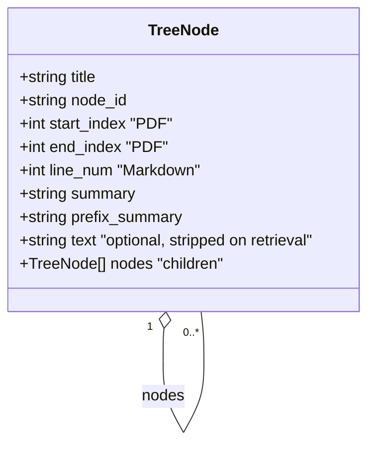

# Data Formats & Schemas 🗂️

This page is the reference for every JSON artifact VectorlessRAG produces and consumes: the **hierarchical tree** that mirrors a document's table of contents, the intermediate flat TOC items it is built from, the document metadata stored in the workspace, the indexing trace logs, and the standalone structure dumps from `run_pageindex.py`.

If you are inspecting an index by hand, debugging an indexing run, or building tooling on top of the stored JSON, this is the document to keep open. It pairs naturally with the [API reference](./api-reference.md), which describes the functions that emit and read these shapes.

A few conventions used throughout:

- Field tables describe the **shape**, not a strict schema — fields marked optional may be absent depending on the document type and the indexing flags used.
- All JSON examples are **illustrative**. Real summaries and descriptions are LLM-written prose; embedding vectors are 384 floats and are shown abbreviated with `...`.
- "PDF" documents are addressed by **physical page numbers**; "Markdown" documents are addressed by **line numbers** (`line_num`). This distinction recurs in nearly every structure below.

---

## The tree node

The tree node is the central data structure. Every indexed document is a list of root nodes, each of which may contain child `nodes`, recursively. The tree mirrors the document's section/subsection hierarchy, and the Navigator stage reasons over it to choose a page range.

### Fields

| Field | Type | Applies to | Description |
| --- | --- | --- | --- |
| `title` | string | both | The section/subsection heading, as detected from the TOC or generated from the body. |
| `node_id` | string | both | Zero-padded identifier assigned during enrichment, e.g. `"0001"`. Stable within a single index. |
| `start_index` | int | PDF | Physical page where the section starts (1-indexed). |
| `end_index` | int | PDF | Physical page where the section ends (1-indexed, inclusive). |
| `line_num` | int | Markdown | Source line number of the section header. Markdown nodes use this instead of `start_index`/`end_index`. |
| `summary` | string | both | LLM-written summary of the node's content. Leaf nodes typically carry a `summary`. |
| `prefix_summary` | string | both | Alternative summary some parent nodes carry instead of `summary` (a roll-up describing the subtree). A node has one or the other. |
| `text` | string | both | Optional raw node text. Verbose; **stripped during retrieval** (see below) and stripped from PDF documents when persisted to the workspace. |
| `nodes` | array | both | Child nodes. Absent or empty on leaves. The recursion that makes the tree a tree. |

Notes:

- `text` is included in the in-memory tree right after indexing (the client requests `if_add_node_text='yes'`), but `get_document_structure` removes it before returning the tree to the Navigator, and `_save_doc` removes it from PDF trees on disk because it is redundant with the per-page `pages` array. See [`pageindex/retrieve.py`](../pageindex/retrieve.py) and [`pageindex/client.py`](../pageindex/client.py).
- `summary` vs `prefix_summary`: tooling that walks the tree should read `node.get('summary') or node.get('prefix_summary', '')` — this is exactly how the internal utilities resolve a node's summary.

### Example: a small PDF tree

This is a trimmed, real-shaped fragment of an indexed PDF (the Git cheat sheet sample). Summaries are abbreviated for readability.

```json
[
  {
    "title": "GIT CHEAT SHEET",
    "node_id": "0000",
    "start_index": 1,
    "end_index": 1,
    "summary": "Overview of common Git commands grouped by workflow stage...",
    "nodes": [
      {
        "title": "STAGE & SNAPSHOT",
        "node_id": "0001",
        "start_index": 1,
        "end_index": 1,
        "summary": "Working with snapshots and the Git staging area..."
      },
      {
        "title": "SETUP",
        "node_id": "0002",
        "start_index": 1,
        "end_index": 1,
        "summary": "Configuring user information used across local repositories..."
      }
    ]
  },
  {
    "title": "INSTALLATION & GUIS",
    "node_id": "0005",
    "start_index": 1,
    "end_index": 1,
    "summary": "Where to download Git and recommended graphical clients..."
  }
]
```

A Markdown tree is identical in shape except each node carries `line_num` instead of `start_index`/`end_index`:

```json
[
  {
    "title": "Getting Started",
    "node_id": "0000",
    "line_num": 12,
    "summary": "Installation and first-run configuration...",
    "nodes": [
      {
        "title": "Prerequisites",
        "node_id": "0001",
        "line_num": 18,
        "summary": "Required tooling and supported versions..."
      }
    ]
  }
]
```

### Node model



The self-reference (`o--`) is the whole point: a node contains zero or more child nodes of the same type, giving the hierarchical tree its depth.

---

## Flat TOC item (intermediate, pre-tree)

Before the hierarchical tree exists, the indexing engine produces a **flat list of TOC items**. Each item records where a section sits and how deep it is. This intermediate form is what `toc_transformer` and the `process_toc_*` strategies emit; it is then folded into the nested tree by the tree-building utilities.

### Fields

| Field | Type | Description |
| --- | --- | --- |
| `structure` | string | Hierarchical numbering, e.g. `"1"`, `"1.2"`, `"1.2.3"`. The dotted depth **encodes the parent/child relationship**. |
| `title` | string | The section heading text. |
| `physical_index` | int | The physical page where the section starts. |

### How `structure` becomes the tree

The `structure` string is the bridge between the flat list and the nested tree. The number of dotted components is the node's depth, and the prefix identifies its parent:

- `"1"` → a root-level node.
- `"1.1"`, `"1.2"` → children of `"1"`.
- `"1.2.3"` → a child of `"1.2"`.

The tree builder reads this dotted path to nest each item under the correct parent, after which `physical_index` becomes the node's `start_index` (end indices are derived from the next section's start), and the enrichment pass assigns `node_id`, summaries, and the document description.

### Example

```json
[
  { "structure": "1",     "title": "GIT CHEAT SHEET STAGE & SNAPSHOT", "physical_index": 1 },
  { "structure": "1.1",   "title": "Working with snapshots and the Git staging area", "physical_index": 1 },
  { "structure": "1.2",   "title": "SETUP", "physical_index": 1 },
  { "structure": "1.2.1", "title": "Configuring user information", "physical_index": 1 }
]
```

During indexing, `physical_index` may briefly appear as a placeholder token (e.g. `"<physical_index_1>"`) in the generation step before a `convert_physical_index_to_int` step resolves it to an integer — you can see both stages in the trace logs described later.

---

## Document metadata

Each indexed document is stored as a single object combining its metadata, its tree (`structure`), and — for PDFs — the extracted per-page text (`pages`). This is the full document record produced by `PageIndexClient.index` and persisted to `workspace/<doc_id>.json`.

### Fields

| Field | Type | Applies to | Description |
| --- | --- | --- | --- |
| `id` | string | both | The document ID (a UUID), also the workspace filename stem. |
| `type` | string | both | `"pdf"` or `"md"`. |
| `path` | string | both | Absolute path to the original source file. |
| `doc_name` | string | both | Display name (typically the original filename). |
| `doc_description` | string | both | LLM-written whole-document description. Used as the text embedded by the Librarian. |
| `doc_description_embedding` | float array | both | 384-dimensional embedding of `doc_description` (sentence-transformers `all-MiniLM-L6-v2`). May be `null` if no embedding model was configured. |
| `page_count` | int | PDF | Number of physical pages. |
| `line_count` | int | Markdown | Number of source lines. |
| `structure` | array | both | The hierarchical tree (list of root nodes; see above). |
| `pages` | array | PDF | List of `{ "page": int, "content": string }`, the extracted text per page so queries never need the original PDF. Markdown documents have no `pages` array — their text lives in the tree's `text` fields and is addressed by `line_num`. |

### Example (trimmed)

```json
{
  "id": "ae795977-5359-4b1b-898b-e7da6475d7f2",
  "type": "pdf",
  "path": "C:\\Users\\udits\\PageIndex\\documents\\git-cheat-sheet-education.pdf",
  "doc_name": "git-cheat-sheet-education.pdf",
  "doc_description": "A comprehensive Git cheat sheet covering setup, staging, branching, and more...",
  "doc_description_embedding": [-0.0161, -0.0265, 0.0377, "...381 more floats..."],
  "page_count": 2,
  "structure": [
    {
      "title": "GIT CHEAT SHEET",
      "node_id": "0000",
      "start_index": 1,
      "end_index": 1,
      "summary": "Overview of common Git commands..."
    }
  ],
  "pages": [
    { "page": 1, "content": "GIT CHEAT SHEET\nSTAGE & SNAPSHOT\nWorking with snapshots..." },
    { "page": 2, "content": "..." }
  ]
}
```

---

## `workspace/` layout

The workspace is the persistent store for indexed documents. It contains one JSON file per document plus a lightweight registry.

```text
workspace/
  _meta.json                                  # registry of all documents
  ae795977-5359-4b1b-898b-...json             # full document record (tree + pages)
  4c2e2c57-eb54-4387-a4c0-...json
  51ebb431-984c-438b-bfb5-...json
```

### `_meta.json` — the registry

`_meta.json` is a map of `doc_id` → a small entry. It holds just enough to drive the Librarian's pre-filter (description + its embedding) without loading every full document into memory.

| Field | Type | Description |
| --- | --- | --- |
| `type` | string | `"pdf"` or `"md"`. |
| `doc_name` | string | Display name. |
| `doc_description` | string | Whole-document description. |
| `doc_description_embedding` | float array | 384-dim embedding of the description (may be `null`). |
| `path` | string | Absolute path to the source file. |
| `page_count` | int | Present for PDF entries. |
| `line_count` | int | Present for Markdown entries. |

```json
{
  "ae795977-5359-4b1b-898b-2c8e...": {
    "type": "pdf",
    "doc_name": "git-cheat-sheet-education.pdf",
    "doc_description": "A comprehensive Git cheat sheet covering setup, staging...",
    "doc_description_embedding": [-0.0161, -0.0265, 0.0377, "...381 more..."],
    "path": "C:\\Users\\udits\\PageIndex\\documents\\git-cheat-sheet-education.pdf",
    "page_count": 2
  }
}
```

### `<doc_id>.json` — the full document

Each `<doc_id>.json` is the complete [document metadata](#document-metadata) record above: metadata + `structure` (tree) + `pages` (PDF only). The `text` field is stripped from PDF tree nodes on save, since the same text is already available page-by-page in `pages`.

### Lazy loading

On startup, the client loads only `_meta.json` into memory (or rebuilds it by scanning the per-document files if the registry is missing or corrupt). The heavy fields — `structure` and `pages` — are **not** loaded until a query actually needs them. `_ensure_doc_loaded` reads the full `<doc_id>.json` on demand the first time `get_document_structure` or `get_page_content` is called for that document. This keeps memory and startup cost proportional to the number of documents, not their total size. See `_load_workspace` and `_ensure_doc_loaded` in [`pageindex/client.py`](../pageindex/client.py).

---

## `logs/` trace format

When the PDF engine indexes a document it appends an audit trail to `logs/<file>_<timestamp>.json`. The file is a **JSON array of trace objects** recorded in order through the indexing pipeline. It is intended for debugging and auditing an index — understanding which strategy ran, what TOC was detected, and how accurate the result was.

> `logs/` is **gitignored** (local-only). Traces are generated on your machine when you index and are never committed.

### Observed keys

Across a trace array you will see objects carrying these keys:

| Key | Where it appears | Meaning |
| --- | --- | --- |
| `total_page_number` | early | Total physical pages in the PDF. |
| `total_token` | early | Total token count across the document. |
| `toc_content` | TOC detection | Raw detected table-of-contents text, or `null` if none was found. |
| `toc_page_list` | TOC detection | List of pages on which a TOC was detected (may be empty `[]`). |
| `page_index_given_in_toc` | TOC detection | `"yes"` / `"no"` — whether the detected TOC lists page numbers. |
| `message` | throughout | Free-form stage messages. Includes `generate_toc: [...]` (flat TOC items being produced) and `convert_physical_index_to_int: [...]` (placeholder page indices resolved to integers). |
| `mode` | strategy result | Which strategy ran, e.g. `process_toc_with_page_numbers`. |
| `accuracy` | strategy result | The `verify_toc` self-signal: fraction of sampled sections whose title genuinely appears on its claimed page (e.g. `1.0`). An **indexing-quality gate**, not an answer-quality metric. |
| `incorrect_results` | strategy result | List of sections that failed verification (empty when all sampled sections checked out). |
| `Response` | LLM steps | Raw model responses, which may include the model's thinking, captured for debugging. |

### Example (trimmed)

```json
[
  { "total_page_number": 2 },
  { "total_token": 1077 },
  { "toc_content": null, "toc_page_list": [], "page_index_given_in_toc": "no" },
  { "message": "generate_toc: [{'structure': '1', 'title': 'GIT CHEAT SHEET STAGE & SNAPSHOT', 'physical_index': '<physical_index_1>'}, ...]" },
  { "message": "convert_physical_index_to_int: [{'structure': '1', 'title': 'GIT CHEAT SHEET STAGE & SNAPSHOT', 'physical_index': 1}, ...]" },
  { "mode": "process_toc_with_page_numbers", "accuracy": 1.0, "incorrect_results": [] }
]
```

The `accuracy` value here (`1.0`) is a per-document indexing self-check on a sample PDF — it confirms the engine placed every sampled section on the right page. It is **not** a benchmark of answer quality. See [evaluation](./evaluation.md) for how this self-signal fits into the project's honest, non-quantitative evaluation story.

---

## `results/` output

The standalone CLI [`run_pageindex.py`](../run_pageindex.py) indexes a single file and writes its tree to:

```text
results/<name>_structure.json
```

The contents are the **same tree shape** described in [The tree node](#the-tree-node) — a list of root nodes with `node_id`, page or line addressing, summaries, and recursive `nodes`. Which fields are present depends on the flags you pass (for example `--if-add-node-id`, `--if-add-node-summary`, `--if-add-node-text`, `--if-add-doc-description`). This is the quickest way to inspect what PageIndex extracts from a document without going through the full query pipeline:

```bash
python run_pageindex.py --pdf_path documents/git-cheat-sheet-education.pdf
# -> results/git-cheat-sheet-education_structure.json
```

See [configuration](./configuration.md) for the full flag and config-key reference, and [getting started](./getting-started.md) for an end-to-end walkthrough.

---

## See also

- [API Reference](./api-reference.md) — the functions that produce and consume these shapes (`index`, `get_document`, `get_document_structure`, `get_page_content`).
- [Architecture](./architecture.md) — how the four query stages move data through these structures.
- [Evaluation](./evaluation.md) — how the `verify_toc` `accuracy` self-signal is (and isn't) used.
- [Documentation index](./README.md) — back to the docs hub.
