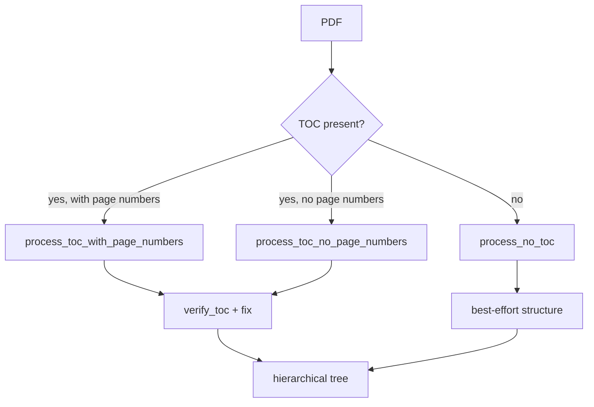

# Engineering & Robustness

The defining engineering stance of VectorlessRAG is that the LLM is one component inside a system that must stay correct even when the model hallucinates, the input document refuses to parse cleanly, or the infrastructure misbehaves. Every stage assumes its inputs may be wrong and degrades to a safe, still-useful state rather than failing hard or, worse, silently returning nothing. This page documents the defensive patterns that make that possible and points to where each lives in the code.

## Graceful degradation of indexing

**What:** PDF indexing is a fallback chain, not a single path. The strategy selector (`meta_processor` in [`../pageindex/page_index.py`](../pageindex/page_index.py)) tries the richest strategy first and falls back as conditions fail: `process_toc_with_page_numbers` -> `process_toc_no_page_numbers` -> `process_no_toc` -> best-effort structure generated directly from body text.

**Why:** Real-world PDFs vary enormously — some have a clean table of contents listing page numbers, some have an unnumbered contents page, many have none at all. A document is never discarded; a hard-to-parse file still ends up with a queryable hierarchical tree, even if that tree was inferred entirely from the body.

**Where:** `check_toc` / `toc_detector_single_page` decide which branch applies; the no-TOC branch builds the hierarchy page group by page group with `generate_toc_init` and `generate_toc_continue`. The chain is:

## Page-offset correction

**What:** Printed page numbers and physical PDF page indices rarely agree — front matter, cover pages, and roman-numeral preludes push "page 1" of the text to physical page 9 or 15. `process_toc_with_page_numbers` infers the offset by matching a handful of section titles to the physical pages where they actually appear, then applies that offset to the whole parsed TOC.

**Why:** Without offset correction, every retrieved page range would be shifted by a constant, and the Reader would return the wrong pages with confident-looking citations. Inferring the offset from real matches makes the correction self-calibrating per document rather than a hard-coded guess.

**Where:** The offset computation lives in `process_toc_with_page_numbers`; correctness is then audited by `verify_toc`, which samples sections and checks via `check_title_appearance` that each title genuinely appears on its claimed page. Sections that fail are relocated between their correct neighbours by `fix_incorrect_toc_with_retries` under a bounded retry budget. See [`./methodology.md`](./methodology.md) for the full indexing walkthrough.

## Robust LLM-output parsing

**What:** Every place that asks the LLM for structured output assumes the reply may be wrapped in prose or fenced code, or be slightly malformed. Parsing is layered: try strict JSON, strip Markdown code fences, then fall back to regex extraction of the fields that matter.

**Why:** LLMs do not reliably emit clean JSON. A single stray backtick or a "Here is the result:" preamble would otherwise crash a stage. Layered extraction keeps the pipeline moving on imperfect output instead of treating every formatting wobble as a fatal error.

**Where:** JSON extraction helpers live in [`../pageindex/utils.py`](../pageindex/utils.py). In the query pipeline ([`../RAGG.py`](../RAGG.py)), the Librarian's document-selection step falls back to regex UUID extraction when the selection reply is malformed (recovering the chosen `doc_id`s directly), and the Navigator's `retrieve_pages` has a fallback parse for the `{"pages": ..., "reasoning": ...}` object so a non-conforming reply still yields a usable page range.

## Type-aware addressing

**What:** PDFs are addressed by physical page number; Markdown is addressed by line number (`line_num` on each node). Both the Navigator prompt and the Reader branch on the document's `type` field so they speak the right coordinate system for each document.

**Why:** Asking the LLM for "pages 3-5" of a Markdown file, or extracting page 4 of a line-addressed tree, would silently retrieve nothing. Type-aware branching prevents that whole class of silent empty-retrieval bugs — the most dangerous kind, because the Generator would then answer "this isn't in the retrieved pages" for content that is actually present.

**Where:** `retrieve_pages` and `get_page_content` in [`../RAGG.py`](../RAGG.py) branch on document type; the lower-level PDF vs Markdown extraction helpers live in [`../pageindex/retrieve.py`](../pageindex/retrieve.py). See [`./data-formats.md`](./data-formats.md) for how `start_index`/`end_index` and `line_num` differ.

## Out-of-bounds and null safety

**What:** Retrieved coordinates are sanitized before extraction. Page or line indices beyond the document's length are truncated to the valid range; non-numeric page values produced by a misformatted LLM reply are coerced or skipped rather than crashing the extractor.

**Why:** The Navigator returns model-authored ranges, which may overrun the document or contain garbage tokens. Truncating and skipping keeps extraction total — it always returns whatever valid spans exist — instead of throwing on the first bad index.

**Where:** Range parsing and bounds handling sit in `get_page_content` and the extraction helpers in [`../pageindex/retrieve.py`](../pageindex/retrieve.py). The Librarian applies the same philosophy to embeddings: a document with no stored `doc_description_embedding` degrades to a neutral similarity score instead of vanishing from candidate retrieval, and `_llm_select_documents_fallback` covers indices that have no stored embeddings at all.

## Cost-aware control flow

**What:** The Generator is conditional. If the upstream stages retrieved nothing — every candidate document was skipped or came back empty — the answer LLM call is not made at all.

**Why:** Calling a 49B-parameter model only to ground it on an empty context wastes money and latency to produce a canned "no information" string. Short-circuiting respects the budget and keeps behaviour honest: no retrieval means no fabricated answer.

**Where:** `generate_answer` in [`../RAGG.py`](../RAGG.py) checks for empty retrieved context before issuing the completion. This pairs with the deliberate choice not to replay prior conversation turns, which keeps each answer grounded strictly in the freshly retrieved pages.

## Explicit provider-key handling

**What:** Provider credentials are set defensively at startup rather than left to library defaults. [`../RAGG.py`](../RAGG.py) reads `NVIDIA_API_KEY` and from it explicitly sets `OPENAI_API_KEY`, `OPENAI_BASE_URL` (`https://integrate.api.nvidia.com/v1`), and `NVIDIA_NIM_API_KEY`, so every code path that routes through LiteLLM finds the credential it expects. Startup also guards on both `NVIDIA_API_KEY` and `OPENROUTER_API_KEY` being present and exits early if either is missing.

**Why:** Relying on an undocumented credential-resolution fallback inside a third-party library is fragile — a minor library upgrade can change which env var it consults, turning a working setup into silent auth failures. Setting the variables explicitly makes authentication a property of this codebase, not of LiteLLM's internals, and the early-exit guard turns a misconfiguration into a clear startup error rather than a confusing mid-query failure.

**Where:** The env-var setup and the startup guard are at the top of [`../RAGG.py`](../RAGG.py). See [`./configuration.md`](./configuration.md) for the full list of keys and where each is consumed.

## The thread that ties these together

None of these mechanisms trusts a single source. The indexer cross-checks the LLM's TOC against the actual document (`verify_toc`), the offset is calibrated from observed matches rather than assumed, the parsers tolerate malformed model output, the extractors clamp out-of-range coordinates, and the orchestrator refuses to spend a model call on an empty context. The result is a system where a misbehaving model, an awkward PDF, or a missing embedding degrades the answer's coverage — never its correctness.

## See also

- [`./methodology.md`](./methodology.md) — the full indexing pipeline, `verify_toc`, and `fix_incorrect_toc_with_retries` in context.
- [`./architecture.md`](./architecture.md) — how the four query stages and the indexing engine fit together.
- [`./README.md`](./README.md) — the documentation index.
