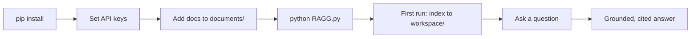

# Getting Started 🚀

This guide takes you from a fresh clone to asking grounded, cited questions over your own documents in about ten minutes.

## Overview

By the end of this guide you will:

1. Install VectorlessRAG and its dependencies (embeddings run **locally**, so no external embedding API is needed).
2. Configure the two required API keys.
3. Drop your own PDFs and Markdown files into `documents/`.
4. Run the interactive app, which indexes each document into a hierarchical tree once, then answers your questions from specific pages with citations.

VectorlessRAG retrieves without a vector database. Each document is parsed by the [PageIndex](./architecture.md) engine into a hierarchical tree that mirrors its table of contents, and at query time an LLM reasons over that tree to decide which pages to read. You stay in the loop: you confirm which documents are searched and which pages are read before any answer is generated.

## Prerequisites

| Requirement | Notes |
| --- | --- |
| Python 3.10+ | Required. |
| NVIDIA NIM API key | **Required.** All LLM calls route to NVIDIA NIM. |
| OpenRouter API key | **Required.** `RAGG.py` exits at startup if either `NVIDIA_API_KEY` or `OPENROUTER_API_KEY` is missing. |
| OpenAI key | Optional. Only for OpenAI-compatible endpoints used by the PageIndex internals / `run_pageindex.py` path. |

Both `NVIDIA_API_KEY` and `OPENROUTER_API_KEY` are hard startup guards in `RAGG.py` — the app will not start without both, even though LLM calls route to NVIDIA NIM.

## Installation

Clone the repository, create a virtual environment, and install the dependencies.

```bash
git clone <your-repo-url> VectorlessRAG
cd VectorlessRAG

# Create and activate a virtual environment
python -m venv .venv

# Windows (PowerShell)
.venv\Scripts\Activate.ps1
# macOS / Linux
source .venv/bin/activate

pip install -r requirements.txt
```

The dependency `sentence-transformers` pulls in `torch` and `transformers` transitively, so the first install is large and may take a few minutes. This is what enables **fully local embeddings** — the Librarian's document pre-filter computes embeddings on your machine with no external embedding API.

## Configure API keys

Copy the example environment file and fill in your keys.

```bash
cp .env.example .env
```

Edit `.env` and set both required keys (placeholders shown):

```text
# Required — NVIDIA NIM authentication
NVIDIA_API_KEY=nvapi-xxxxxxxxxxxxxxxxxxxxxxxxxxxxxxxx

# Required — passed as the PageIndex client api_key
OPENROUTER_API_KEY=sk-or-xxxxxxxxxxxxxxxxxxxxxxxxxxxxxxxx

# Optional — only for OpenAI-compatible endpoints
# OPENAI_API_KEY=sk-xxxxxxxxxxxxxxxxxxxxxxxxxxxxxxxx
# OPENAI_BASE_URL=https://api.openai.com/v1
```

At runtime `RAGG.py` derives the OpenAI-compatible settings it needs from `NVIDIA_API_KEY`, setting `OPENAI_BASE_URL=https://integrate.api.nvidia.com/v1` and `NVIDIA_NIM_API_KEY` for you. Your `.env` is git-ignored, so keys stay local. See [Configuration](./configuration.md) for the full list of keys and config options.

## Add documents

Drop the files you want to query into the `documents/` folder. Both PDF and Markdown are supported.

```bash
documents/
├── your_handbook.pdf
├── meeting_notes.md
└── ...
```

The repository already ships three sample PDFs (a Git cheat sheet, a LangChain/LangGraph interview Q&A, and a Kubernetes interview Q&A), so you can try the app before adding your own files.

## Run the interactive app

```bash
python RAGG.py
```

**First run — indexing.** On the first run, each document in `documents/` is parsed into a hierarchical tree and saved under `workspace/` (as `workspace/<doc_id>.json`, with a lightweight registry in `workspace/_meta.json`). Indexing is LLM-intensive: the engine detects the table of contents, builds the tree, writes per-node summaries, and runs an internal verify step. Subsequent runs reuse the saved trees, so you only pay this cost once per document.

**Asking questions.** Once indexing finishes, type a question. The four-stage pipeline runs with a human-in-the-loop checkpoint at each decision:

1. **Librarian** — picks the 1-3 most relevant documents and shows them; you confirm, re-query, or narrow by name.
2. **Navigator** — proposes a page plan with its reasoning, for example `{"pages": "3-5,8", "reasoning": "..."}`; you confirm, manually override the range, or skip the document.
3. **Reader** — extracts the text for the chosen pages (or lines, for Markdown) and tags each span with its source.
4. **Generator** — answers **only** from the retrieved context and cites the document and pages. If nothing was retrieved, the answer step is skipped entirely.

**Built-in commands:**

| Command | Action |
| --- | --- |
| `info` | List the indexed documents. |
| `exit` / `quit` | Leave the app. |

For a deeper walkthrough of each stage, see [Architecture](./architecture.md).



## Index a single file (optional)

To index just one file and inspect its tree without launching the interactive app, use `run_pageindex.py`. It writes the resulting tree to `results/<name>_structure.json`.

```bash
# A PDF
python run_pageindex.py --pdf_path documents/your_file.pdf

# A Markdown file
python run_pageindex.py --md_path documents/your_file.md
```

This is handy for debugging or auditing how a document was parsed before querying it. See the [API Reference](./api-reference.md) for the full set of `run_pageindex.py` flags and the [data formats](./data-formats.md) doc for the tree schema.

## Troubleshooting

| Symptom | Likely cause and fix |
| --- | --- |
| App exits immediately at startup | A required key is missing. Set both `NVIDIA_API_KEY` and `OPENROUTER_API_KEY` in `.env`. |
| No documents found | The `documents/` folder is empty or has no `.pdf` / `.md` files. Add at least one supported file. |
| "This information isn't in the retrieved pages." | The Navigator returned no pages, or the answer genuinely isn't on the read pages. Re-query, or override the Navigator's page range. |
| First index is slow | Expected — indexing is LLM-intensive (TOC detection, tree build, summaries, verify). It runs once per document; later runs reuse `workspace/`. |

## See also

- [Configuration](./configuration.md) — all API keys, `config.yaml` keys, and defaults.
- [Architecture](./architecture.md) — the PageIndex engine and the four query stages in depth.
- [API Reference](./api-reference.md) — `PageIndexClient`, `run_pageindex.py` flags, and tool functions.
- [Documentation index](./README.md)
