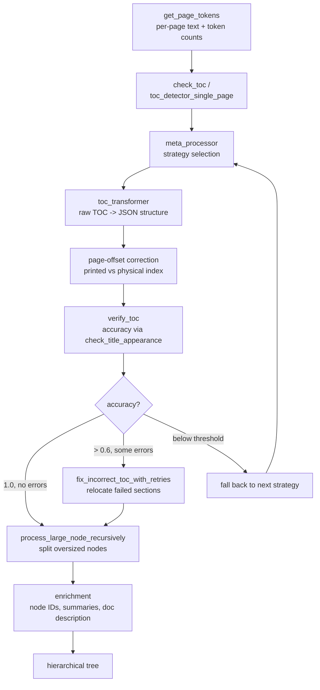
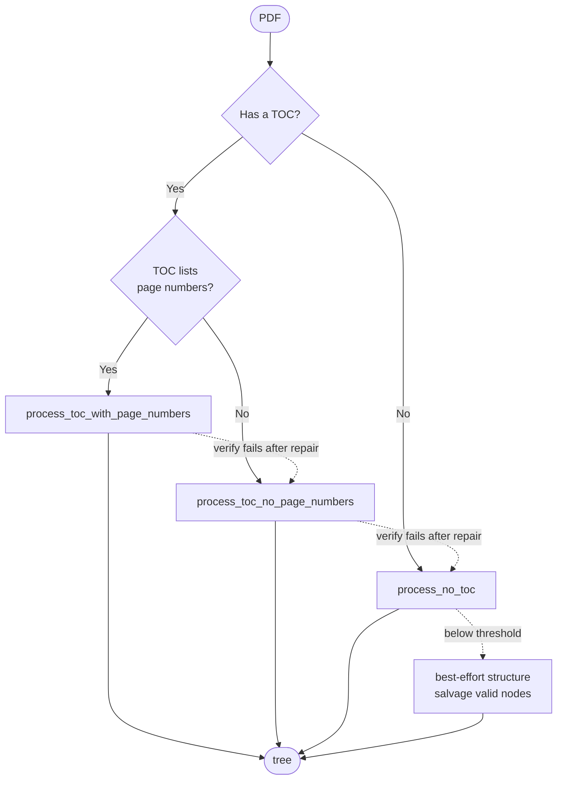
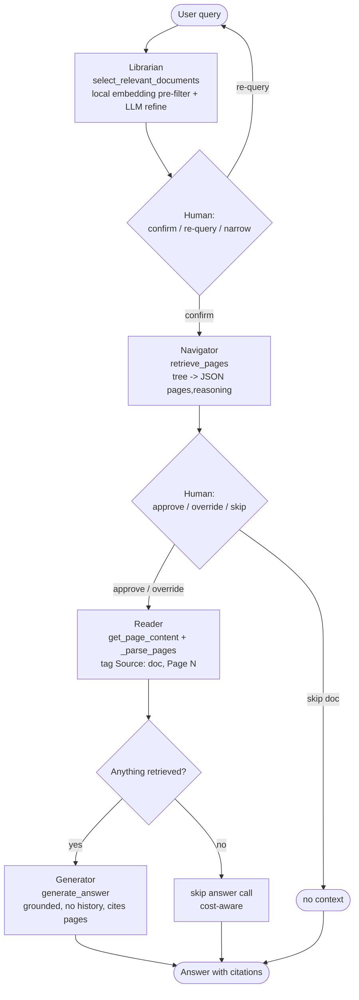

# How It Works (Methodology) 🧭

This is the deepest technical document in the suite. It walks the full algorithm end to end: how `VectorlessRAG` turns a document into a hierarchical tree (Phase A — indexing) and how it answers a question by reasoning over that tree (Phase B — querying).

The guiding principle is simple: **retrieval is reasoning over structure, not nearest-neighbour over embeddings.** Instead of embedding chunks into a vector database, `VectorlessRAG` builds a tree that mirrors a document's table of contents — sections, subsections, page ranges, and LLM-written summaries — and lets an LLM scan that tree the way a person scans a contents page, then read only the pages it chose.

For the conceptual and theoretical framing, see [./research-background.md](./research-background.md). For the component map and data flow, see [./architecture.md](./architecture.md). This page keeps the math light and stays close to the code.

---

## Phase A — Indexing a document into a tree (PDF)

PDF indexing is implemented in [`../pageindex/page_index.py`](../pageindex/page_index.py) (the `page_index` engine). It is **adaptive and multi-strategy**: it inspects the document, picks the cheapest strategy that can produce a faithful structure, verifies the result, repairs what it can, and degrades gracefully rather than discarding a document it cannot perfectly parse.

The pipeline has seven steps.

### Step 1 — Page tokenisation (`get_page_tokens`)

The engine reads the PDF with PyMuPDF (falling back to PyPDF2) and produces, for every physical page, its extracted text and a token count. This `page_list` of `(text, token_count)` pairs is the substrate everything else operates on: token counts drive chunking decisions and the recursive subdivision thresholds later in the pipeline.

### Step 2 — TOC detection (`check_toc`, `toc_detector_single_page`)

The engine scans the first `toc_check_page_num` pages (default `20`) looking for a printed table of contents. `toc_detector_single_page` classifies a page as a TOC page or not, and — crucially — determines **whether that TOC lists page numbers**. This single bit (`page_index_given_in_toc`: `"yes"` / `"no"`) selects the indexing strategy in the next step. The detected TOC text and the list of TOC page numbers are carried forward as `toc_content` and `toc_page_list`.

### Step 3 — Strategy selection (`meta_processor`)

`meta_processor` is the dispatcher. Based on whether a TOC exists and whether it carries page numbers, it routes to one of three strategies.

| Strategy | When it is used | What it does |
| --- | --- | --- |
| `process_toc_with_page_numbers` | A TOC exists **and** lists page numbers | Parses the printed TOC into structured entries, then computes a page **offset** so printed page numbers map to true physical PDF indices (Step 4). |
| `process_toc_no_page_numbers` | A TOC exists but has **no** page numbers | Parses the section hierarchy from the TOC text, then locates each section's start by scanning the body text for its title. |
| `process_no_toc` | **No** TOC was found | Generates the hierarchy directly from the body text with the LLM, processing page groups in sequence (`generate_toc_init` for the first group, then `generate_toc_continue` to extend it). |

In all three paths the raw structure is normalised by `toc_transformer`, which converts free-form TOC text into JSON entries carrying a hierarchical `structure` field (e.g. `1.2.3`), a `title`, and a `physical_index`. Long TOCs are chunked into `max_toc_chunk_tokens`-sized pieces (default `4000`) before transformation.

### Step 4 — Page-offset correction (printed page number vs physical PDF index)

This step matters because **the page number printed on a page is rarely the same as that page's physical index in the PDF.** Front matter, cover pages, and roman-numeral preludes shift everything. `process_toc_with_page_numbers` matches a handful of section titles to the physical pages they actually appear on, infers the constant **offset** between the printed and physical numbering, and applies it to every entry. The result is a TOC whose `physical_index` values point at real PDF pages.

### Step 5 — Verification (`verify_toc` → accuracy score)

`verify_toc` samples sections from the candidate structure and, for each, calls `check_title_appearance` to test whether the section's title genuinely appears on the page it claims. The fraction that pass is an **accuracy** score (e.g. `1.0`).

This is an **indexing-quality self-signal**, not an answer-quality metric and not a benchmark. It answers one question: "did we place sections on the right pages?" `verify_toc` returns both the accuracy and a list of `incorrect_results` (the sections that failed). See [./evaluation.md](./evaluation.md) for how this self-signal fits into the project's honest evaluation story.

### Step 6 — Self-repair (`fix_incorrect_toc_with_retries`)

If accuracy is high but imperfect, the engine does not start over — it repairs the few failures in place. `fix_incorrect_toc_with_retries` relocates each failed section by searching between its two correct neighbours (the section before and after it must be in the right place), with a bounded number of attempts (`max_attempts=3`). The thresholds in `meta_processor` are explicit:

```text
accuracy == 1.0 and no incorrect results   -> accept the structure as-is
accuracy >  0.6 and some incorrect results  -> repair in place, then accept
otherwise                                   -> fall back to the next strategy (Step "decision tree")
```

### Step 7 — Recursive refinement and enrichment

Two finishing passes complete the tree.

- **Recursive large-node refinement (`process_large_node_recursively`).** Any node whose span exceeds `max_page_num_each_node` (default `10` pages) or `max_token_num_each_node` (default `20000` tokens) is split into finer subsections, recursively, until every leaf is small enough to read comfortably. This keeps later page selections precise.
- **Enrichment.** The engine assigns each node a zero-padded `node_id` (e.g. `"0001"`) when `if_add_node_id` is on, generates a per-node `summary` when `if_add_node_summary` is on, and generates a whole-document `doc_description` when `if_add_doc_description` is on. Summaries are what make the tree *readable by an LLM at query time* — they let the Navigator judge a branch without reading its pages.

### Phase A pipeline (flowchart)



---

## Indexing strategy decision tree

The three strategies form a **graceful-degradation chain**. The engine starts with the strongest applicable strategy. If verification cannot be satisfied even after repair, it falls back to the next-weaker strategy rather than failing. The last resort — `process_no_toc` — never discards the document: when accuracy is below threshold it salvages the valid nodes and returns a best-effort structure so the document still indexes and stays queryable.



The fallback order is exactly: `with_page_numbers` → `no_page_numbers` → `no_toc` → best-effort. This is the project's central robustness guarantee for indexing; the engineering details behind "never discard the document" live in [./engineering-robustness.md](./engineering-robustness.md).

---

## Markdown indexing (`md_to_tree`)

Markdown is structured very differently from a PDF, so it gets its own engine, [`../pageindex/page_index_md.py`](../pageindex/page_index_md.py) (`md_to_tree`). There is no page geometry and no printed TOC to recover — the headers *are* the structure.

The pipeline:

1. **Header regex extraction.** Headers `#` through `######` are matched with a regex, skipping anything inside code fences (so a `#` in a shell snippet is not mistaken for a heading).
2. **Text spans.** The text between each header and the next is captured as that node's body.
3. **Optional thinning.** When thinning is enabled, nodes smaller than a token threshold are merged into their neighbours, so the tree is not cluttered with trivially small sections.
4. **Stack-based tree build.** Header levels are pushed and popped on a stack to reconstruct nesting (an `##` under the most recent `#`, an `###` under the most recent `##`, and so on).
5. **Line-number addressing.** Each node records a `line_num` — the line where its header sits — instead of a page range.
6. **Async LLM summaries.** Per-node summaries are generated concurrently, the same enrichment idea as the PDF path.

### Pages (PDF) vs line numbers (Markdown)

This distinction propagates through the entire system and is the single most important type difference to keep straight.

| | PDF | Markdown |
| --- | --- | --- |
| Engine | `page_index` ([`../pageindex/page_index.py`](../pageindex/page_index.py)) | `md_to_tree` ([`../pageindex/page_index_md.py`](../pageindex/page_index_md.py)) |
| Node addressing | `start_index` / `end_index` (physical pages) | `line_num` (line number) |
| What the Navigator returns | a page range, e.g. `"3-5,8"` | a set of line numbers |
| Why | PDFs have stable physical pages | Markdown has no pages; lines are the natural unit |

The retrieval prompt is **type-aware** (see Phase B, Navigator) so the LLM is told whether it is choosing pages or lines.

---

## Phase B — Querying the library

Querying is orchestrated by the interactive CLI [`../RAGG.py`](../RAGG.py). It is a four-stage pipeline — **Librarian → Navigator → Reader → Generator** — with a **human-in-the-loop (HITL)** checkpoint at each decision. The user can confirm, override, narrow, or skip at every stage, which keeps a human in control of what gets read and what the answer is grounded in.

All three LLM roles route through LiteLLM to NVIDIA NIM (`INDEXING_MODEL = RETRIEVAL_MODEL = ANSWER_MODEL = nvidia_nim/nvidia/llama-3.3-nemotron-super-49b-v1`). Embeddings used by the Librarian run **locally** via `sentence-transformers/all-MiniLM-L6-v2` — no external embedding API.

### Step 1 — Librarian (`select_relevant_documents`)

The Librarian narrows the whole library down to the one to three documents most likely to hold the answer. It works in three moves:

1. **Local embedding pre-filter.** Each document has a single 384-dimensional embedding of its **description** (document granularity only — never chunks). The query is embedded with the same local `all-MiniLM-L6-v2` model, scored by cosine similarity against every document description, and the top-N (default `5`) are kept. This is a coarse, cheap shortlist, not the final answer.
2. **LLM refinement.** The LLM reads the shortlisted descriptions and refines the selection down to one to three documents.
3. **Fallback.** For indices that have no stored embeddings, `_llm_select_documents_fallback` lets the LLM select directly from document metadata, so the Librarian still works.

### Step 2 — Human verification

The user confirms the Librarian's choice, re-queries, or narrows by document name. Nothing proceeds without this checkpoint.

### Step 3 — Navigator (`retrieve_pages`)

The Navigator sends the chosen document's **tree** (titles, summaries, and addresses — text fields stripped) to the LLM and asks which pages to read. The prompt is **type-aware**: PDFs are addressed by physical page numbers, Markdown by `line_num`. The LLM returns a small JSON object — the retrieval contract:

```json
{ "pages": "3-5,8", "reasoning": "..." }
```

The `reasoning` field is shown to the user, who then approves the range, manually overrides it, or skips the document entirely. Because the tree (titles + summaries) fits in context, the LLM is choosing a branch by *reading the contents page*, not by similarity search.

### Step 4 — Reader (`get_page_content`)

The Reader extracts the actual text for the chosen pages or lines via [`../pageindex/retrieve.py`](../pageindex/retrieve.py). The range string from the Navigator is parsed by `_parse_pages`, which understands ranges and lists (e.g. `"5-7"` → `5,6,7`, `"3,8"` → `3,8`) and returns a sorted, de-duplicated list of indices. Each extracted span is tagged with its provenance, `[Source: <doc_name>, Page N]`, so the next stage — and the final citation — can attribute every fact.

### Step 5 — Generator (`generate_answer`)

The Generator answers **only from the retrieved context**, under a strict grounded system prompt:

- If the answer is not in the retrieved pages, it says so verbatim: *"This information isn't in the retrieved pages."*
- It **cites** the document and pages it used.
- **Prior conversation turns are intentionally not replayed.** This is deliberate: replaying history would let the model answer from memory of earlier turns rather than from the freshly retrieved pages, eroding grounding.
- **Cost-aware skip.** If nothing was retrieved, the answer LLM call is skipped entirely — no tokens are spent producing a guess.

### Query pipeline with HITL (flowchart)



---

## Why this is "reasoning over structure"

A vector RAG system flattens a document into chunks and retrieves by embedding similarity — it never sees the document's shape. `VectorlessRAG` keeps the shape and discards the embeddings (except for one coarse document-level pre-filter).

The mechanism is straightforward: the **hierarchical tree fits in the model's context window** because it is titles, summaries, and addresses — not full text. The LLM reads those titles and summaries and **chooses a branch**, exactly as a person flips to a book's table of contents, decides "the answer is in Chapter 4," and turns to those pages. Only then is real text read, and the answer is grounded in those specific pages with page-level citations.

That is the whole idea: **retrieval as navigation over a structure the model can reason about**, rather than nearest-neighbour lookup over an opaque vector index. The deeper theoretical framing — why structure-as-context generalises and how it compares to embedding retrieval — is developed in [./research-background.md](./research-background.md).

---

## See also

- [./architecture.md](./architecture.md) — components, data flow, and where each module fits
- [./research-background.md](./research-background.md) — the theory and conceptual framing behind reasoning over structure
- [./engineering-robustness.md](./engineering-robustness.md) — graceful degradation, retries, and "never discard the document"
- [./README.md](./README.md) — documentation index
